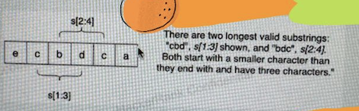

A product name at Amazon is represented as a string s of length n that consists of lowercase English letters.

A team at Amazon working on a product's search algorithm. They want to know the length of the longest substring in a product name with its first character lexicographically smaller than its last. A valid substring must be longer than 1 character. If no such substring exists, return 0.

Note: A character a is lexicographically smaller than character b if a appears in the English alphabet sequence before b.

Function Description

Complete the function getLongestSubstring in the editor below.

getLongestSubstring has the following parameter:

string s: the product name
Returns

int: the length of the longest valid substring

Test Case:

Input: s = "ecbdca"
Output: 3

There are two longest valid substrings: "cbd", s[1:3] shown, and "bdc", s[2:4];
Both start with a smaller character than they end with and have three characters.
Return their length, 3. Note that "cbdc" is not valid since the starting
character is not smaller than the last.

Input: s = "abcd"
Output: 4

The entire string is a valid substring. Here, a is lexicographically
smaller than d, so it is a valid substring.

Input: s = "fghbbadcba"
Output: 5

The longest valid substring is "bbadc". Here, b is lexicographically
smaller than c, so it is a valid substring.
